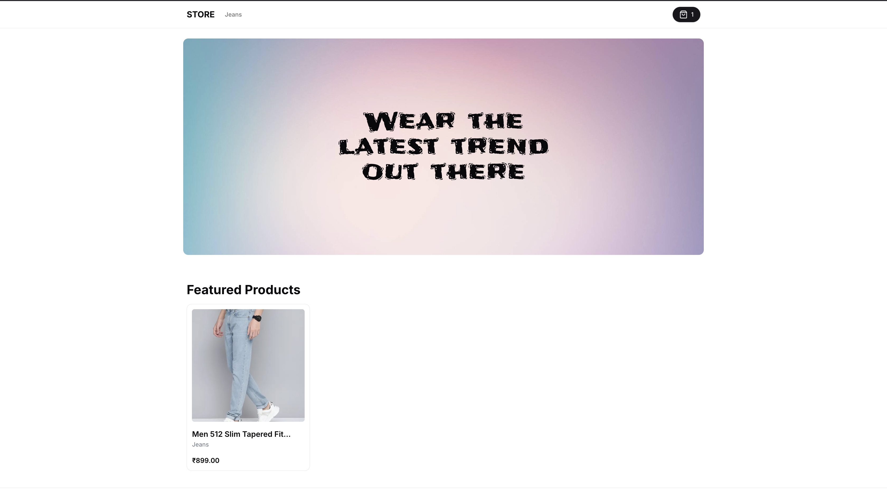

## E-commerce Store 
This is a [Next.js](https://nextjs.org) project bootstrapped with [`create-next-app`](https://nextjs.org/docs/app/api-reference/cli/create-next-app).

This is the store of CMS project that I built. It consist of two parts i.e admin panel and ecommerce store. Beauty of the project is that user can manage all of his store from single dashboard and get analytic review in graph format about each store.

## Tech Stack
- Nextjs14 - Full Stack Framework
- Tailwindcss & Shadcnui - Styling 
- Typescript - Primary Language
- Reactjs - Javascript Framework
- Zustand - State Management

### ENV to add to make it work from admin panel

- Get this in Setting after creating account and store.
```
NEXT_PUBLIC_API_URL=https://url/api/random-string
```
- This is primary billboard that appear when store is accessed. The ID can be copied after creating the billboard
```
NEXT_PUBLIC_MAIN_BILLBOARD="cm2nu97b16705tex7lvwej6v1"
```
- Below is demo billboard image



Read More at: [ajaymandal.me](https://ajaymandal.me)